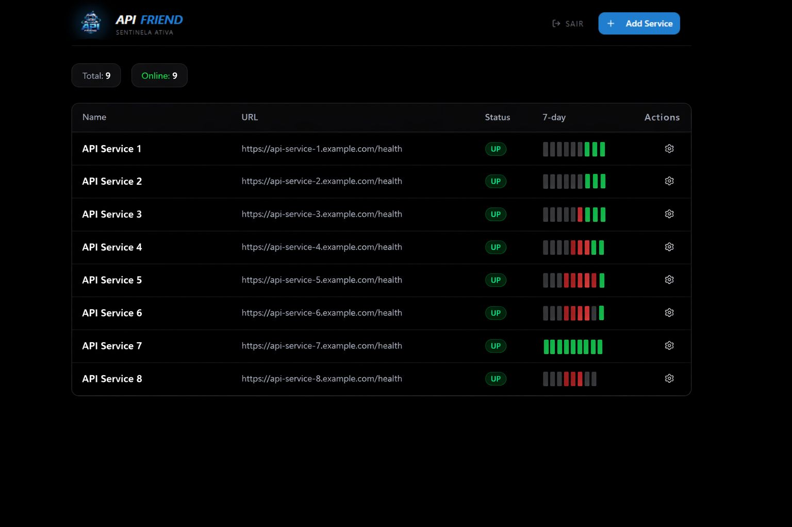

# 🚀 API Friend - Monitoramento & Auto-Healing Coolify

O **API Friend** não é apenas um "status checker". É uma sentinela de elite projetada para desenvolvedores que exigem resiliência total. Enquanto ferramentas comuns apenas avisam que algo caiu, o API Friend resolve o problema disparando redeploys inteligentes via Coolify antes mesmo de você notar a falha.

Este é um projeto com objetivos absurdos: eliminar o downtime humano através de automação reativa.

---

## 🛠️ Stack Tecnológica

O ecossistema foi construído para ser leve, rápido e tipado:

- **Linguagem:** [TypeScript](https://www.typescriptlang.org/) (Segurança e escalabilidade)
- **Runtime:** [Node.js](https://nodejs.org/) (Performance assíncrona)
- **Framework Web:** [Express 5](https://expressjs.com/) (Roteamento moderno)
- **Persistência:** [MongoDB](https://www.mongodb.com/) + [Mongoose](https://mongoosejs.com/) (Flexibilidade de dados)
- **Monitoramento:** [Axios](https://axios-http.com/) (Pings customizados com controle de timeout)
- **Containerização:** [Docker](https://www.docker.com/) & Docker Compose
- **Orquestração de Processos:** [PM2](https://pm2.keymetrics.io/) (Resiliência da própria sentinela)

---

## 🌟 O Diferencial: Webhooks de Redeploy (Coolify)

O maior trunfo do API Friend é a sua integração profunda com o **Coolify**. Ele não apenas observa; ele age.

*   **Monitoramento 24/7:** A aplicação testa seus serviços em intervalos definidos.
*   **Detecção de Anomalia:** Se um serviço retorna erro ou fica instável, o status muda para offline.
*   **Ação Imediata (Auto-Healing):** O API Friend dispara um webhook avançado para o Coolify, forçando o redeploy da aplicação afetada.
*   **Notificação Rica no Discord:** Um card detalhado é enviado ao seu canal, informando o erro e confirmando que a tentativa de recuperação já foi iniciada.
*   **Grace Period:** Inteligência integrada para respeitar o tempo de boot da aplicação, evitando loops de redeploy desnecessários.

---

## 📋 Como Funciona a Lógica Interna

### 🛡️ Watchdog Inteligente
O motor (`monitor.ts`) gerencia um mapa dinâmico de intervalos. Se você adicionar ou remover um serviço via API, o monitor se ajusta em tempo real sem precisar reiniciar o servidor.

### 🔗 Integração Discord
As mensagens não são simples textos. São embeds formatados que mostram:
- ✅ **Nome do Serviço**
- 🔗 **URL afetada**
- ❌ **Status da Resposta**
- ⏰ **Timestamp da Falha**

---

## 🌍 Acesse Agora

A sentinela já está em operação! Você não precisa configurar nada localmente para começar a usar:

🔗 **URL:** [https://api-friend.vercel.app](https://api-friend.vercel.app/)

🛡️ **Acesso:** Basta fazer login com sua conta do **Google**. Seus serviços monitorados ficarão vinculados exclusivamente ao seu perfil, garantindo total privacidade e controle.

  Desenvolvido com ⚡ por <a href="https://github.com/felipesantos5">Felipe Santos</a>

